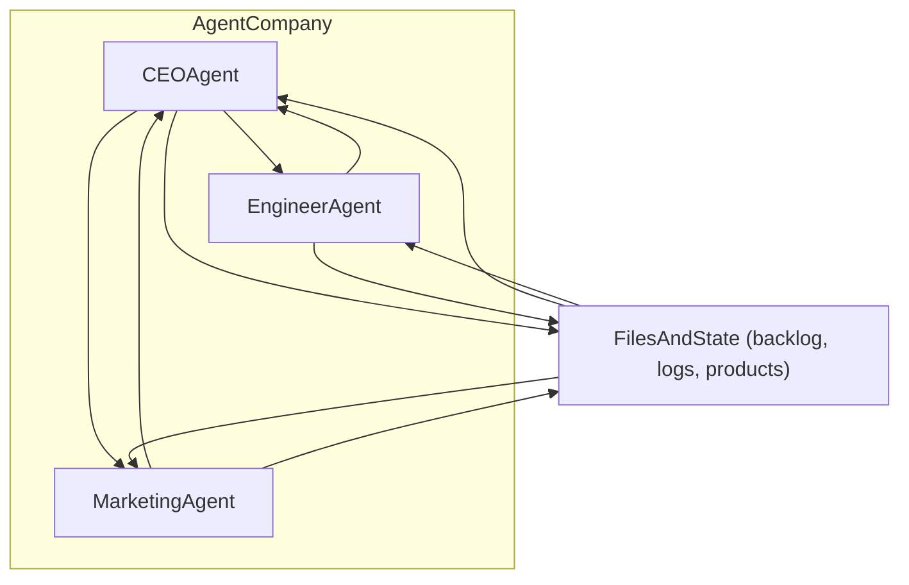

# Autonomous 3-Agent Company with CrewAI

## High-level design

- **Tech stack**: Python + CrewAI, using OpenRouter models via the `OPENROUTER_API_KEY` in `.env`.
- **Agents**: `CEO`, `Engineer`, `Marketing`, each a CrewAI `Agent` with clear goals and responsibilities.
- **Execution mode**: Long-running loop that runs an idea → build → market cycle repeatedly until you stop it.
- **Communication & tracking**: All cross-agent communication and progress tracking is persisted to `company_state/` (markdown + JSON files).

## Project structure

- **Core files**
  - `requirements.txt`: Dependencies for CrewAI, OpenRouter connectivity, and web research.
  - `README.md`: Setup and usage documentation.
  - `main.py`: Entry point; loads environment, initializes agents/crew, and runs the main loop.
- **Company package**
  - `company/__init__.py`: Constants and package init.
  - `company/llm_config.py`: OpenRouter `LLM` configuration (base URL, model selection, env-driven overrides).
  - `company/agents.py`: Defines `CEO`, `Engineer`, `Marketing` agents with tools and role-specific behavior.
  - `company/tasks.py`: Defines tasks and assembles them into a sequential crew (CEO → Engineer → Marketing).
  - `company/state_io.py`: State management and file-based tracking helpers.
  - `company/file_tools.py`: CrewAI tools for file-based collaboration (backlog/spec/files/logs).
  - `company/web_tools.py`: Controlled web research tools (search + summary).

## File-based communication & progress tracking

All state lives under `company_state/`:

- `company_state/backlog.json`: Kanban-style tasks with fields like `id`, `title`, `description`, `assigned_to`, `status`, timestamps.
- `company_state/logs/ceo.md`, `engineer.md`, `marketing.md`: Per-agent time-stamped logs.
- `company_state/products/<product_slug>/spec.md`: CEO-authored product vision and requirements.
- `company_state/products/<product_slug>/engineering/`: Engineer-created code and tests.
- `company_state/products/<product_slug>/marketing/`: Marketing assets (landing copy, emails, social posts, experiments).
- `company_state/changelog.md`: Runtime changelog appended automatically once per cycle/iteration.

## OpenRouter + CrewAI configuration

Use `.env`:

- `OPENROUTER_API_KEY`: OpenRouter API key.
- `OPENAI_API_BASE=https://openrouter.ai/api/v1`: OpenAI-compatible base URL for OpenRouter.
- `OPENAI_MODEL_NAME=openrouter/<model_id>`: Default model used by agents.

CrewAI uses LiteLLM fallback for OpenRouter, enabled via `crewai[litellm]`.

## Main loop behavior

- On each cycle:
  - Load state from `company_state/`.
  - Build a compact context summary (active product, backlog, recent logs).
  - Run tasks sequentially: CEO decides + assigns → Engineer implements → Marketing publishes assets.
  - Persist outputs and append to `company_state/changelog.md`.

## Web research capabilities

- CEO and Marketing can call `web_search_and_summarize(query)` for market research and positioning.

## Usage and safety knobs

- `MAX_CYCLES_PER_RUN`: Cap the number of cycles per run.
- `CYCLE_DELAY_SECONDS`: Sleep between cycles to avoid runaway loops / rate limits.

